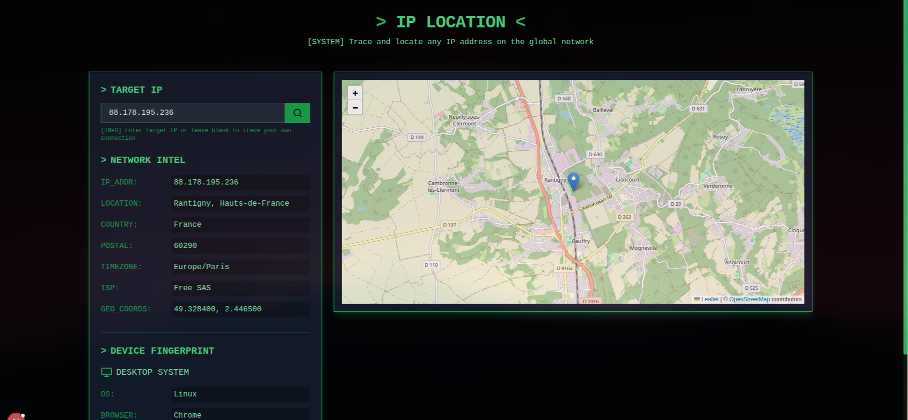

# IP Location Tracker



Welcome to **IP Location Tracker** – an innovative, cutting-edge tool for tracing and locating any IP address on the global network. Designed with a hacker-inspired aesthetic, this project leverages modern web technologies to deliver a sleek, responsive, and robust experience.

---

## Table of Contents

- [Overview](#overview)
- [Features](#features)
- [Technology Stack](#technology-stack)
- [Installation](#installation)
- [Usage](#usage)
- [Contributing](#contributing)
- [Contact](#contact)

---

## Overview

IP Location Tracker is a powerful web application enabling you to trace IP addresses with precision. Built using the latest in React, Next.js, Tailwind CSS, and Leaflet, the application renders detailed maps and geolocation data fetched in real-time. Whether you're a network professional or a security enthusiast, IP Location Tracker is your go-to tool for public IP investigations.

---

## Features

- **Real-Time IP Lookup**: Retrieve geolocation data instantly.
- **Interactive Map**: Explore precise locations on a dynamic map built with Leaflet.
- **Responsive Design**: Fully responsive interface with a hacker-styled theme.
- **User-Friendly Interface**: Simple, minimalistic UI with clear and concise navigation.
- **Error Handling**: Proper handling for reserved IP addresses and network errors.
- **Next-Generation Tech**: Built with Next.js and Tailwind CSS for ultimate performance.

---

## Technology Stack

- **Frontend**: React, Next.js
- **Styling**: Tailwind CSS
- **Mapping**: Leaflet, React-Leaflet
- **APIs**: ipapi.co for real-time geolocation data
- **Bundler**: Webpack

---

## Installation

1. **Clone the Repository**

   ```bash
   git clone https://github.com/nalikiru-dev/ip-location-tracker.git
   cd ip-location-tracker
   ```

2. **Install Dependencies**

   ```bash
   npm install
   ```

3. **Run the Development Server**

   ```bash
   npm run dev
   ```

4. **Build for Production**

   ```bash
   npm run build
   npm start
   ```

---

## Usage

- **Enter an IP Address**: Use the input field on the homepage to enter a valid IP address.
- **View Results**: The application will fetch geolocation information and display it on the interactive map.
- **Error Handling**: If a reserved or invalid IP is entered, the app will display a clear error message.

> **Note:** The application will default to showing a loading state if the remote API is slow.

---


## Contributing

Contributions are welcome! To contribute:

1. Fork the repository.
2. Create a new branch: `git checkout -b feature/YourFeatureName`
3. Commit your changes: `git commit -am 'Add new feature'`
4. Push your branch: `git push origin feature/YourFeatureName`
5. Open a pull request.

---

## Contact

For any inquiries or feedback, feel free to contact me on GitHub:

- **GitHub**: [@nalikiru-dev](https://github.com/nalikiru-dev)

---

Enjoy tracing IP addresses and happy hacking!
